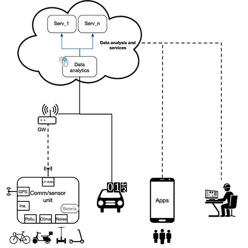

 

El proyecto MECANO tiene como objetivo mejorar la movilidad urbana mediante el uso de medios de transporte sostenibles eficientes y seguros, y el seguimiento y reducción de la huella de carbono, incluido su impacto en la ciudadanía. Para ello, se propone la conexión de los nuevos vehículos de movilidad personal a Internet, aprovechando las nuevas tecnologías de comunicación del Internet de las Cosas (IoT). De ahí que estos vehículos se consideren como "sensores móviles" que se mueven por las ciudades inteligentes. Los datos recopilados de los vehículos y los sensores de la carretera se someten a un procesamiento inteligente para monitorear los parámetros de contaminación y proporcionar servicios para optimizar la movilidad urbana, detectar áreas de contaminación, recomendar pistas saludables y gestión dinámica / predictiva del tráfico.
 
MECANO propone desarrollar una plataforma para recoger datos de los vehículos de movilidad personal, prestando especial atención a los dispositivos de movilidad eléctrica y reduciendo las emisiones y el ruido. Se está desarrollando una plataforma embarcada basada en tecnologías de comunicación de red de área amplia de baja potencia (LPWAN), que permite la conexión a Internet siguiendo un esquema de IoT. La unidad está provista de datos de calidad del aire, monitoreo de CO2, CO, NO, NO y PMx, entre otros; contaminación acústica; radiación solar; y parámetros climáticos. Estos datos se procesan en una granularidad configurable a nivel de calle, por barrio, por distrito y ciudad, considerando también los datos de volumen de tráfico, para ofrecer servicios de movilidad. Estos servicios utilizan técnicas de optimización para minimizar los tiempos de viaje, la contaminación y la exposición a altos niveles de contaminación.

<b>Objetivos</b>

<ul>
<li>Diseñar una unidad embarcada que integre comunicaciones IoT y sensores para vehículos de movilidad personal. Integración de unidades en vehículos reales.</li>
<li>Monitorización de la contaminación mediante sensores móviles a bordo de los vehículos.</li>
<li>Micro y macro monitoreo del tráfico urbano.</li>
<li>Desarrollar algoritmos para identificar patrones de contaminación y predecir tendencias.</li>
<li>Desarrollar servicios de gestión del tráfico utilizando técnicas de optimización, enfocadas a la salud peatonal y utilizando un transporte sostenible.</li>
<li>Extrapolar los resultados a nuevos planes urbanísticos que fomenten el uso del transporte sostenible.</li>
<li>Desplegar un piloto experimental utilizando e-scooters y aplicaciones reales para explotar los avances de MECANO.</li>
</ul>

